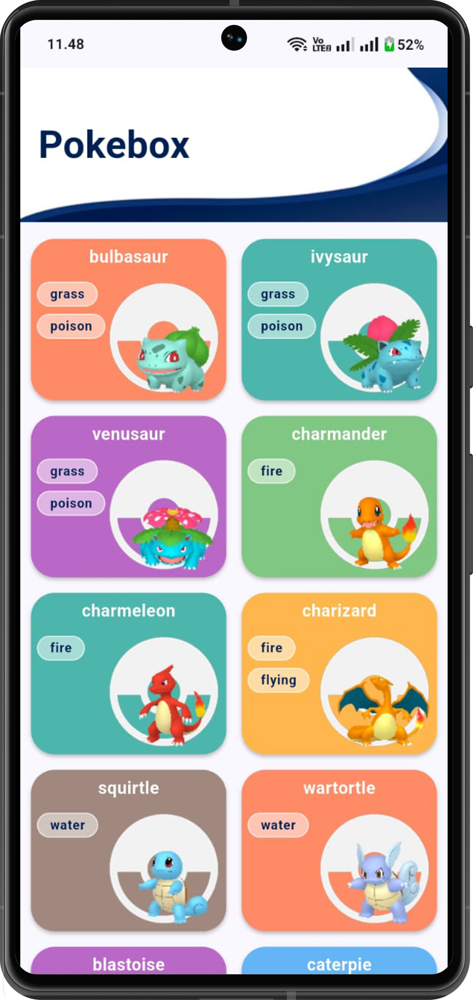
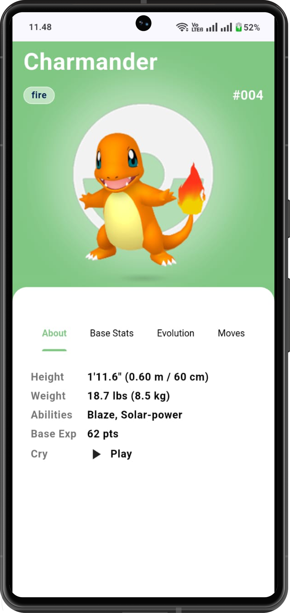
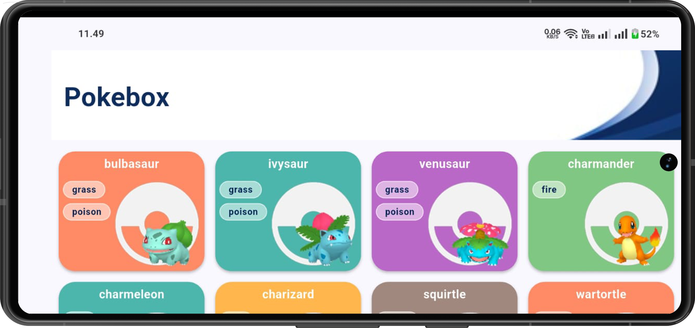
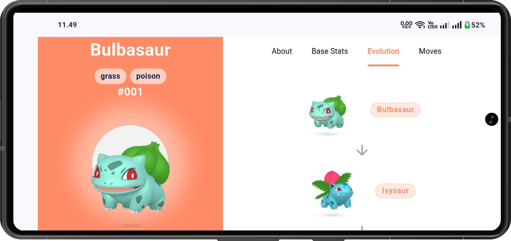

# Pokebox

Pokebox adalah aplikasi mobile **Flutter** yang menampilkan daftar Pokémon dan detailnya. Aplikasi ini mendukung **mode portrait dan landscape** dengan tampilan responsif, menggunakan **PokeAPI** sebagai sumber data.

---

## Fitur

- Daftar Pokémon dengan gambar dan tipe
- Detail Pokémon: About, Base Stats, Evolution, Moves
- Tampilan responsif untuk portrait dan landscape
- Caching gambar untuk performa lebih baik
- Mendukung build release dan debug

---

## Screenshot

### Portrait Mode
<p float="left">
  
  
</p>

### Landscape Mode
<p>
  
  
</p>

---

## Instalasi

### Persyaratan
- Flutter 3.10+  
- Android Studio / VS Code  
- Android SDK minimal 21  

### Clone repository
```bash
git clone https://github.com/lionelyayan/pokebox.git
cd pokebox
